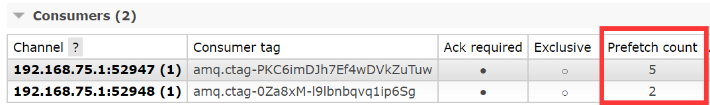

# MQ消息队列

### MQ
> `削峰`、`异步`、`解耦`

### 角色
> `Producter`：`tcp连接懒加载`->`开启channel`->`声明交换机、队列`->`send message`->`交换机类型匹配队列`->`关闭channel`->`断链`
>
> `Consumer`：`tcp连接懒加载`->`开启channel`->`receive message`->`ack机制`->`关闭channel`->`断链`
>
> 

### 组件
> `Channel` 多路复用tcp的双向通道
>
> `Message` 消息头 + 消息体，消息头包含（routing-key、delivery-mode、priority）
>
> `Queue` 多个消费者订阅一个队列时，消息会被平摊
>
> `Exchange` 如果没有queue绑定，消息则丢弃
>
> 

### routingKey 和 bingingKey
> `routingKey` 生产者发送消息带的`header`属性
>
> `bingingKey` 交换机和队列绑定的关系

### 六种工作模式
> `simple简单模式` 一个生产者、一个队列、一个消费者（点对点，默认交换机，key为队列名）
>
> `work工作模式` 一个生产者、一个队列、多个消费者（一般`轮询`模式分发，负载均衡）
>
> `发布/订阅模式` 一个生产者、一个 Fanout Exchange、多个队列、多个消费者（扇形交换机）
>
> `路由模式` 一个生产者、一个 Direct Exchange、多个队列、多个消费者（直连交换机）
>
> `主题模式` 一个生产者、一个 Topic Exchange、多个队列、多个消费者（主题交换机）
>
> `RPC模式` 客户端（同时也是响应消费者）、服务端（同时也是响应消费者）、一个请求队列、一个回复队列（同步等待）

### 队列声明
```shell
    /**
     * 1.队列名
     * 2.`durable` 消息是否需要持久化硬盘
     * 3.`exclusive` 是否排他，排他加锁点对点；不排他 Work模式
     * 4.`autoDelete` 是否自动删除
     */
    channel.queueDeclare(QUEUE_NAME, true, false, false, null)
```

### ack机制 
> `自动机制` 分发给消费者后就删除消息
>
> `手动机制` 需要手动确认

```shell
    /**
     * 1.`deliveryTag`
     * 2.`multiple` 是否批量处理
     */
    channel.basicAck()

    /**
     * 1.`deliveryTag`
     * 2.`multiple` true批量处理
     * 3.`requeue`  true消息重新排队；false丢弃或者转移到死信队列
     */
    channel.basicNack()

    /**
     * 1.`deliveryTag`
     * 2.`requeue` 选择false
     */
    channel.basicReject()
```

| 方法         | 说明            | 场景 |
|-------------|-----------------|:--------------:|
| `basicAck`  | 确定             |               |
| `basicNack` | 拒绝单条/多条消息  | 推荐使用，效率高 |
| `basicReject` | 只能拒绝单条消息 |               |

### 持久化
> `队列持久化` `Features表示为 D ` `durable=true`
>
> `消息持久化` `delivery_mode=2` 极短的时间窗口（消息刚被接收到但还未被写入磁盘时）可能丢失消息
>
> `持久化队列` + `持久化消息` + `发布确认机制`
>
> 

### 不公平分发
> `prefetch_count=1` 消息均匀地分发，在`ack`之前最多可以堵塞1条
>
> `prefetch_count=30` 消息处理很快且想减少网络开销，可以设置为 `10-100`
>
> `prefetch_count` 设置越大，吞吐量更高，优先级越高
>
> 

```shell
    /**
     * 1.`prefetch_count` 1代表平均
     * 2.`prefetch_size` 默认为0，也只能为0
     * 3.`global` 默认为false，针对每个消费者限制
     */
    channel.basicQos(1, 0, false)
```

### 发布确认机制
> `发布确认` Publisher Confirms，[生产者 → RabbitMQ]，生产者将信道设置为 `confirm` 模式，保证消息已安全到达Broker
>
> `消息确认` Consumer ACK，[RabbitMQ → 消费者]，保证消息已被成功消费

```shell
    /**
    * 1.开启通道发布确认
    */
    channel.confirmSelect()
```

| 方法              | 说明             |
|------------------|:----------------:|
| `单条确认`        | 堵塞等待，吞吐量低  |
| `批量确认`        | 如果一批100条中只有1条失败，也需要重发100条，难以找出异常信息  |
| `异步确认`        | 注册两个回调函数：`setAckhandler`，`setNackhandler`，实现困难 |


### 交换机类型
> `direct` 直连交换机[路由模式]，精准匹配，生产者`routing-key`和交互机`binding-key`，点对点消息，也支持1对多的绑定关系
> + 多个队列都用相同的`Binding Key`绑定到同一个`Direct Exchange`，则全部收到消息
> + `Direct Exchange 1对多`和`Fanout Exchange`区别在 `无视路由键`
>
> `fanout` 扇形交换机[发布-订阅模式]，广播形式通知绑定的队列，无视路由键`routing-key`，发布订阅
>
> `topic` 主题交换机[主题模式]，模式匹配，带有通配符的`binding-key`匹配消息的`routing-key`，多维度消息分发
>  + `*` 匹配一个单词（用 . 分隔的部分）
>  + `#` 匹配零个或多个单词
>
> `headers` 头，无视路由键，通过`headers` 匹配，两种匹配方式`x-match: all`和`x-match: any`，性能比`topic`差

### 死信队列（DLX）
> 消费异常进入该队列，保证消息不丢失
>
> 来源：`basic.nack/basic.reject(requeue=false)`、`ttl过期`、`队列满了 x-max-length`
>
> `x-dead-letter-exchange`、`x-dead-letter-routing-key`, 参数修改之后需要 删除交换机、队列
>
> 路由键`normal`被覆盖为死信队列路由键`DLK`，发送给死信交换机`DLX`
>
> 

### 延迟队列（TTL + 死信队列）
> 设置的是消息的过期时间，非队列过期时间

### 延迟队列（插件版）
> 本质逻辑：`x-delay`消息存储在插件内部的 `Mnesia` 数据库
>
> 需要插件支持 `https://github.com/rabbitmq/rabbitmq-delayed-message-exchange/releases`
>
> 类型为`x-delayed-message`
>
> `x-message-ttl`消息停滞的时间，即进入死信队列时间 
>
> `x-delay`交换机延迟投递的时间；发布消息的时候 header带上`x-delay`

### 发布高级确定（publisher -> broker）
> `confirmType=correlated` 等同于 `channel.confirmSelect()`，区分一个配置层，一个代码层
>

| confirmType 配置   | 说明             |
|-------------------|:----------------:|
| `correlated`      | 发送消息到交换机，无论成功or失败都会触发回调函数，包括  |
| `none`            | 禁止发布确认  |
| `simple`          | 同`单条确认`一致 |

### 回退消息（broker -> publisher）
> broker收到消息，由于无法投递，回退通知生产者
>
> `ReturnsCallback` 回退处理

```shell
    /**
    * true回退、false丢弃
    */
    rabbitTemplate.setMandatory(true)
```

### 备份交换机
> 处理一些无法路由的消息，例如回退的消息
>
> 声明交换机的时候同时声明一个备份的交换机，当交换机接收到无法路由的消息，则不会被丢弃，进入到备份交换机，有点类似`死信交换机`
>
> 备份交换机类型一般为 `fanout`，无需路由键；`alternate-exchange` 核心参数
>
> `备份交换机` 和 `回退消息` 是互斥的，`备份交换机` 优先级更高
>
> `死信队列` vs. `备份交换机`
> + `死信队列` (DLX)：处理的是已经成功进入队列但被消费者拒绝或过期的消息
> + `备份交换机` (AE)：处理的是根本没能进入任何队列的消息


| 特征      | Mandatory 回退机制                | 备份交换机                               |
|------------|--------------------------------|:--------------------------------------:|
|处理方式     | 手动处理：生产者需要编写回调逻辑     | 自动处理：由 RabbitMQ Broker 自动完成消息转发  |
|灵活性      | 可在回调中编写任意复杂补救逻辑       | 只能将消息路由到另一个交换机，处理方式固定    |
|代码侵入     | 需要在生产者代码中设置             | 声明交换机绑定即可                        |
|适用场景     | 定制化补救策略                    | 自动化、集中化处理无效消息的场景            |

### 优先级队列
> 理论上队列是`FIFO`，开启优先级之后，会使用最大堆`Max Heap`数据结构管理消息
>
> 声明队列时设置 `x-max-priority=10`，定义队列优先级范围，推荐1-10之间，数值越大，CPU开销越高
>
> 发送消息 `AMQP.BasicProperties.Builder().priority(8)`，定义消息的优先级，必须在 `x-max-priority=10` 之内
>
> 不设置`priority`，默认为0 [数值越大，优先级越高]
>
> 无法影响到 `prefetch_count=10` 预取消息的顺序

### 惰性队列
> 队列有两种模式 `default` 和 `lazy`
>
> 队列声明 `x-queue-mode` 为 `lazy`

| 特征        | 传统队列                        | 惰性队列                               |
|------------|--------------------------------|:-------------------------------------:|
|优点         | `低延迟`                        | `高吞吐`、`大容量`、`稳定性`             |
|消息存储     | 优先存于内存，内存不足时换页到磁盘   | 立即持久化到磁盘                        |  
|适用场景     | 实时处理、低延迟任务               | 削峰填谷、日志处理、大批量任务            |

### 集群
> `普通集群`：横向扩展，并不是高可用的，无法解决单节点故障问题
>
> `镜像集群`：在普通集群的基础上，增加了`队列主从复制`的功能

### 源文
RabbitMq消息队列详解[https://blog.csdn.net/qq_52030824/article/details/127639558]

