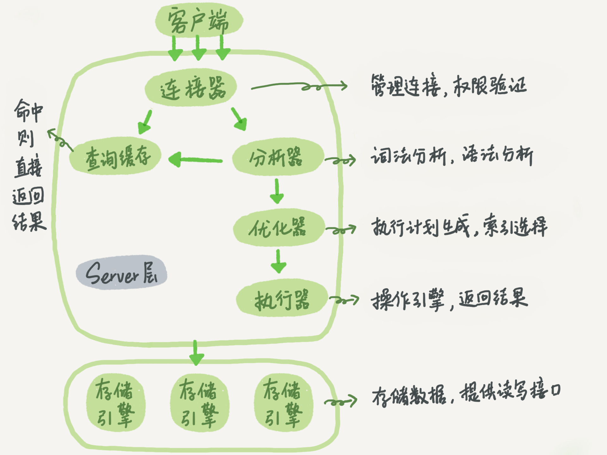

# mysql

### 数仓 clickHouse todo 以后了解


### mysql锁
> 共享锁： 共享锁是一种读锁，允许多个事务同时读取同一数据行，但不允许写入;
>
> 排他锁： 排他锁用于写操作，确保数据在写入时不会被其他事务干扰，保证数据的一致性;
>
> 行锁: 锁定数据表中的单行数据;
>
> 表锁: 锁定整个数据表;


### 表锁的场景
> 对表进行结构性修改
>
> MyISAM存储引擎的写操作
>
> 索引操作,新建或删除索引
>
> 查询索引失效导致的锁升级
>
> 全局锁是对整个数据库实例加锁，通常用于全库的逻辑备份


### 如何优化锁的性能
> 选择合适的事务隔离级别 [事务隔离级别](#事务隔离级别)
>
> 合理设置索引 [索引优化](#索引优化)
>
> 使用读写分离
>
> 分区表 [分区表](#分区表)
>
> 避免死锁 [死锁处理](#死锁怎么处理)
>
> 避免表级锁


### 事务隔离级别
> READ_UNCOMMITTED (未提交读) | 会出现脏读
>
> READ_COMMITTED (读已提交)
>
> REPEATABLE READ (可重复读) MySQL的默认隔离级别 | 不可重复读 
>
> SERIALIZABLE (可串行化) 性能最低，因为事务需要等待其他事务完成

> + 脏读：读到了别的事务回滚前的脏数据
>
> + 不可重复读：事务A首先读取了一条数据，然后执行逻辑的时候，事务B将这条数据改变了，然后事务A再次读取的时候，发现数据不匹配了，就是所谓的不可重复读了
>
> + 幻读：当前事务读第一次取到的数据比后来读取到数据条目少
>
> + 不可重复读/幻读  两者有些相似，但是前者针对的是update或delete，后者针对的insert

| 隔离级别       | 脏读   | 不可重复读 | 幻读   | 并发性能 |
|----------------|--------|------------|--------|----------|
| READ UNCOMMITTED | 是     | 是         | 是     | 最高     |
| READ COMMITTED   | 否     | 是         | 是     | 中       |
| REPEATABLE READ  | 否     | 否         | 是     | 中       |
| SERIALIZABLE     | 否     | 否         | 否     | 最低     |

```mysql
SELECT @@tx_isolation;
```


### 索引优化
- 避免全表查询，建立合适的索引，使用`explain`分析语句 [explain](#explain)
- 用查询的字段代替 * 
- 分区分表分库


### explain
`partitions` 表示查询涉及的分区信息
`key` 实际使用的索引
`key_len` 实际使用的索引长度（单位为字节），越短，索引效率越高
`rows` 估算的需要扫描的行数
`filtered` 条件过滤后的行数，值较低，说明过滤条件不够有效

`type` 查询的访问类型，从最好到最差依次为：
- `system`：表中只有一行数据
- `const`：通过主键或唯一索引直接定位到一行数据
- `eq_ref`：对于每个索引键，表中只有一条匹配记录（通常用于主键或唯一索引的等值查询）
- `ref`：使用索引进行非唯一查询（如 WHERE 子句中使用非唯一索引）
- `range`：使用索引进行范围查询（如 WHERE column BETWEEN ...）
- `index`：全索引扫描，比全表扫描稍快。
- `ALL`：全表扫描，性能最差。
- 优化建议：尽量避免 `ALL` 和 `index` 类型的查询，优先使用 `const`、`eq_ref` 或 `ref`

`ref` 查询条件与索引之间关系
- const 或 具体的列名，说明性能较好
- func 或 NULL，需要进一步优化

`extra` 额外的执行信息
- `Using index` 查询只使用索引，不需要回表查询
- `Using where` 通过 WHERE 子句过滤数据
- `Using temporary`  MySQL 需要创建临时表来处理查询
- `Using filesort`  MySQL 需要进行文件排序，性能较差
- `Using join buffer`  使用了连接缓冲区
- 尽量避免 `Using temporary` 和 `Using filesort`，可以通过优化索引或调整查询语句来避免
- 如果出现 `Using join buffer`，可能需要优化连接查询

### SUBSTRING_INDEX
```
SELECT
 	SUBSTRING_INDEX( item_id, '-', - 1 ) AS pure_id 
 FROM
 	b_airec_item 
 WHERE
 	item_type = 'image' 
 	AND SUBSTRING_INDEX( category_path, '_', 1 ) IN ( '设计', '硬装', '知识', '家房' );
```


### 在遇到重复数据时会忽略这些数据继续插入其他数据
```shell script
INSERT IGNORE INTO b_case_section_pub(case_id,space,space_order)\n
```


### 校对规则问题 
> `utf8mb4_general_ci` 不区分大小写
>
> `utf8mb4_bin` 区分大小写


### 索引大小
> `int` 4字节、`bigint` 8字节
>
> `https://www.cnblogs.com/aeolian/p/18363229`


### 分区分表
> `https://blog.csdn.net/u010647035/article/details/106374248/`


### 索引合并
> 见语雀 `https://zhuanlan.zhihu.com/p/708385592`


### join大表优化
> `https://blog.csdn.net/wenqiangluyao/article/details/125786096`

> 驱动表小表 - 被驱动表大表
> + `SNLJ` (Simple Nested-Loop Join) [简单嵌套循环连接] 单纯双层for循环
>
> + `BNLJ` (Block Nested-Loop Join) [缓存块嵌套循环连接] 将驱动表的数据加载到内存上，减少了磁盘 I/O 的次数 `Join Buffer`决定，没有索引会倾向于使用
>  + `MySQL 8.0` 默认为 256KB
>
> + `INLJ` (Index Nested-Loop Join) [索引嵌套循环连接] 单条处理驱动表记录，再通过索引匹配被驱动表数据，通常是最优的，连接条件需走索引
>
> + `Hash Join` `MySQL 8.0`引入，小表构建成哈希表，对大表的每条记录，用连接键去哈希表中查找匹配项，只需扫描两个表各一次
>  + 必须是等值连接 `a.id = b.a_id`，非等值连接`>, <, like` 等无法使用
>  + 连接字段没有索引 或索 引成本过高
>  + 被驱动表数据量较大 `分块处理`

> 优化思路：
> + 减少双层for循环的次数
>  1. 减少外层循环次数 → 小表驱动大表
>  2. 最优解 `Index Nested-Loop Join` 
>
> + 减少被驱动表的数据量大小
>  1. 通过 ON、WHERE 提前过滤（`on` 比 `where`优先）
>  2. 临时表


### 我说MySQL每张表最好不超过2000万数据，面试官让我回去等通知？
> `https://juejin.cn/post/7165689453124517896`


### 索引失效的情况
> + 隐式类型转换
> + 模糊查询以 `%` 开头 `like "%ABC"` 
> + `函数运算`操作索引字段
> + `join` 两表编码不同
> + 联合索引不满足 `最左前缀原则`
> + `not in、<>, !=、is not null` 可能会导致（视场景而定）
>  1. 依赖匹配比例
>  2. `is not null` 基本不生效


### or 会导致索引失效吗？
> + 同一列, 走索引
> + 不同列，都有单列索引，有索引合并（MySQL 5.5 开始）
> + 不同列，存在没有索引，失效

> 推荐使用 `union`、`in`


### 如何处理死锁
> + 查看死锁日志 `show engine innodb status;`
> + 分析死锁的sql
> + 核心方案
>  1. 统一事务的加锁顺序
>  2. 减少持锁时间
>  3. 合理设置锁等待超时
>  4. 避免使用高隔离级别 `READ COMMITTED`


### 日常中如何优化SQL
> + 加索引
> + 避免返回不必要的数据
> + 适当分批量进行
> + 优化表结构
> + 主从架构，主从复制
> + 分表分库分区


### 分表分库可能遇到的问题
> + `事务问题`：需要用分布式事务啦
> + `跨节点 Join 的问题`：解决这一问题可以分两次查询实现
> + `跨节点的 count,order by,group by 以及聚合函数问题`：分别在各个节点上得到结果后在应用程序端进行合并
> + 数据迁移，容量规划，扩容问题
> + `ID 问题`：数据库被切分后，不能再依赖数据库自身的主键生成机制啦，最简单可以考虑 `UUID`
> + `跨分片的排序分页问题`
>  1. 小页码场景：用 “分片预取 多取 + 全局聚合”
>  2. 大页码场景：必须用 “游标分页” 替代偏移量分页


### InnoDB 与 MyISAM 的区别
> + InnoDB 支持ACID 事务、外键、MVCC；MyISAM 不支持
> + InnoDB 支持表、行级锁，而 MyISAM 支持表级锁
> + InnoDB 崩溃可以无损恢复，MyISAM 可能会丢失
> + InnoDB 适合并发场景，MyISAM 适合静态数据 [读少写多]


### 盘点那些被问烂了的 Mysql 面试题 目前截止到5.0 | TODO 
> `https://learnku.com/articles/61064`
>
> > 